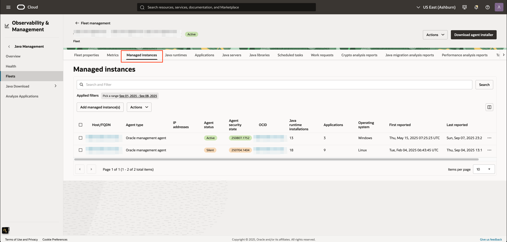

# Run JDK Flight Recorder (JFR)

## Introduction

This lab walks you through the steps to run JDK Flight Recorder (JFR) on any Java application in your fleet.

Estimated Time: 20 mins

### Objectives

In this lab, you will:

* Create a JDK Flight Recorder Work Request using the Java Management Service console interface with the "Default.jfc" profile.
* View and monitor the status of Work Requests created using the Java Management Service console interface.
* Download the generated JFR file for further analysis.

### Prerequisites

* You have signed up for an account with Oracle Cloud Infrastructure and have received your sign-in credentials.
* You are using an Oracle Linux image or Windows OS on your Managed Instance for this workshop.
* Access to the cloud environment and resources configured in [Lab 1](?lab=set-up-and-enable-advanced-features-on-java-management-service).
* Have a Java application capable of running longer than 15 mins in your instance.

## Task 1: Submit JDK Flight Recorder Work Request

1. First, open the navigation menu, click **Observability & Management**, and then click **Fleets** under **Java Management**. Select the fleet that you have configured in [Lab 1](?lab=set-up-and-enable-advanced-features-on-java-management-service).

    

2. Scroll down the **Fleet** details page. Under the **Resources** menu, select **Managed instances**.

    You should see a list of Managed instances that are currently in your Fleet. Select the Managed instance you are interested in.

    

3. Scroll down and under **Resources**, select **Applications**. You should see a list of Java applications running in this managed instance. Select the long running Java application you want to run with JFR.  Click on **Actions** and select **Run JDK Flight Recorder**.

    

4. In the **JDK Flight Recorder** (JFR) Window, select **Recording option**: **Select from default profiles**.

    Under the **Select default profiles**, click the dropdown menu and select **Default.jfc**.

    Lower the **Max recording duration** to **5 mins** and keep **Max recording size** at **500MB**. Click **Start** to begin the JFR recording.

    > Note: Ensure your application runs longer than the duration specified.

    

    

5. Click on the **fleet** name at the top of the **Managed Instance** page. This should navigate back to the **Fleet** details page.

    

6. Scroll down to the **Resources** menu and select **Work requests**. You should see a list of the Work Requests that are currently in your Fleet. **JDK Flight Recorder** that was started should be at the top of the list.

    

7. Wait for the work request to be processed. If the work request has been completed successfully, the status will change to **Completed without Errors**.

    > **Note:** It will take approximately 15 minutes for the request to be completed.

    

8. To access the report, navigate to the **Fleet** details page and click the **Object storage bucket** name under **Object storage**.

    

9. The raw copy of the **JDK Flight Recorder** report is stored in the file: **JMS** > **JFR** > **fleet-ocid** > **instance-ocid** > **application-name.jfr**

    

10. You can open the **JDK Flight Recorder** recording in your favorite JFR viewer or you can use the Oracle's **JDK Mission Control** to view the files. 

    JMC download link: https://www.oracle.com/java/technologies/jdk-mission-control.html

You may now **proceed to the next lab.**

## Learn More
 * Refer to the [Advanced Features](https://docs.oracle.com/en-us/iaas/jms/doc/advanced-features.html), [Work Requests](https://docs.oracle.com/en-us/iaas/jms/doc/using-java-management-service.html#GUID-77AEEBC0-93A5-4E99-96D6-BEE0FEE4539F) sections of the JMS documentation for more details.

 * Use the [Troubleshooting](https://docs.oracle.com/en-us/iaas/jms/doc/troubleshooting.html#GUID-2D613C72-10F3-4905-A306-4F2673FB1CD3) chapter for explanations on how to diagnose and resolve common problems encountered when installing or using Java Management Service.

 * If the problem still persists or it is not listed, then refer to the [Getting Help and Contacting Support](https://docs.oracle.com/en-us/iaas/Content/GSG/Tasks/contactingsupport.htm) section. You can also open a support service request using the **Help** menu in the OCI console.

## Acknowledgements

* **Author** - Somik Khan, November 2022
* **Last Updated By** - Eugene Kazlou, September 2025
